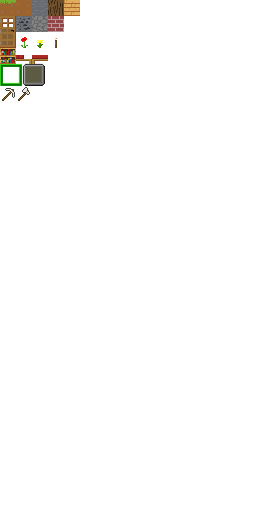

# Project
## Description
This project is a simple game made with SFML.

## KeyBindings
- **Right click** - Place a block
- **Left click** - Break a block or attack a monster
- **Middle click** - Place a block in the background
- **Q** - Go left
- **D** - Go right
- **Space** - Jump
- **Escape** - Quit the game
- **P** - Pause the game
- **I** - Display the inventory

## Inventory
In the game you have an inventory. You can open it by pressing **I**. In the inventory you can see the items you have collected. You can also move the items in the inventory by clicking on them and dragging them. 

You can also change the item in your hand by clicking **1**, **2**, **3**, **4**, **5**, **6**, **7**, **8** or **9**, you can also change the item by scrolling up or down.

You can also craft items by cliking on left click on the block you want to craft. For this feature we use linked list with the possibility to make a loop :

[WOOD] -> [PLANK] -> [LIBRARY] 

[STONE] -> [COBBLESTONE] -> [BRICK] -> first element of the list (loop)

[YELLOW_FLOWER] -> [RED_FLOWER] -> [TORCH] (if you are in the night)

[YELLOW_FLOWER] -> [RED_FLOWER] (if you are in the day)

[DIRT] -> [GRASS] -> first element of the list (loop)


## Map Interaction
You can brock blocks when you have a pickaxe in your hand by clicking on them with the left mouse button. 

You can also place blocks when you have a block in your hand by clicking on the map with the right mouse button.

If you want to place blocks in the background you can with the middle mouse button. (wheel click)

## Map Generation
The map is generated randomly this is different steps of the generation :
- first with a perlin noise we init a vector of the size of the width of the map with the altitude of the map for example :
[1,2,2,3,3,3,4,4,4,4,3,3,3,2,2,1]
```
0000001111000000
0001110000111000
0110000000000110
1000000000000001
```

- then we add the stone layer with the altitude of the map
- then we add cave with an open simplex noise
- then we add dirt layer with the altitude of the map
- then we add grass layer with the altitude of the map
- then we add trees
- then we add flowers

for the noise part we use the library [FastNoiseLite](./include/lib/fastnoise/FastNoiseLite.h)

## Monsters
There are 2 types of monsters in the game :
- Walking monsters
- Flying monsters

Every night a defined amound of monsters spawn and attack the player. The player can kill them by clicking on them with the left mouse button with a sword in is hand.

## Game Over
If the player dies, the game is over. The player can restart the game by clicking on the button "Restart" or quit the game by clicking on the button "Quit".

## Save
The game is saved when the player quit the game. The save is loaded when the player start the game.

## Sound 
There are 2 types of sounds in the game :
- Background music
- Sound effects

You can mute the sound and the music by clicking on the button "Mute" or unmute them by clicking on the button "Unmute" in the start menu or in the pause menu.

## DayNightCycle
The day night cycle use seconds in the game the amount of seconds in a day is definied in const file.
To change the sky color we use a gradient image :

We suppose the night color is in the middle of the image and the day color is at the start and the end of the image.

## SpriteSheet
We use a spritesheet for every image exept for the mute / unmute button and the background gradient image.



## How to run the project
First, you need to install the dependencies. You can do it by running the following command:
```bash
sudo apt-get install libsfml-dev
sudo apt-get install cmake
```

Then, you can run the project by running the following commands:
```bash
mkdir build
cd build
cmake ..
make run
```

